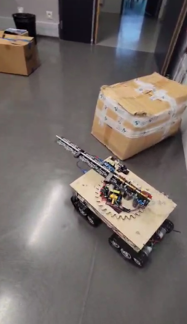
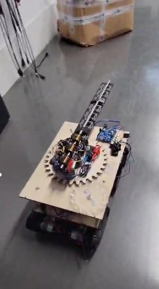
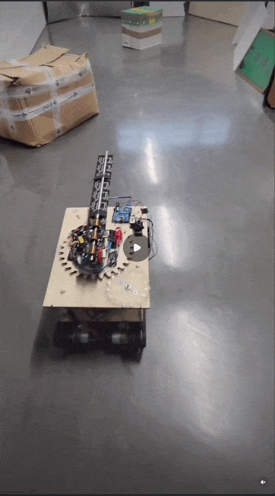

  <!-- Vue de gauche, statique -->
  
  <!-- Un peu d'espace vide pour créer l'effet de décalage -->
  &nbsp; &nbsp; &nbsp;
  <!-- Vue de droite, statique -->
  

  <!-- LE GIF ANIMÉ AU CENTRE (Remplace image-1.png) -->
  

## Project Timeline & Contributions

* **September 2023 (Project Launch):** The project officially started with the design and construction of a tracked military robot chassis, motorization, obstacle detection and avoidance algorithms, and an electromagnetic railgun built with the assistance of a teaching assistant (handled by Nicolas Consalvi), alongside target detection and computer vision systems (handled by Youssef Miri).
* **September 2024 – February 2025 (Intermission):** Nicolas Consalvi temporarily paused work on the project while studying abroad at Tianjin University, China.
* **Year 2 (Erasmus Support):** During Nicolas's absence, an Erasmus exchange student joined the team to assist Youssef Miri with the mechanical aspects of the project.
* **February 2025 – April 2025 (Project Resumption):** Work resumed for a concentrated two-month period, focusing heavily on algorithm robustification, specifically replacing the tracks with wheeled mobility equipped with encoders for precise movement.

## Repository Structure

This repository is organized to cleanly separate academic documentation, progress tracking, multimedia demonstrations, and source code:

* **`Bibliography/`**: Shared theoretical research, documentation, and literature reviews (provided in both English and French).
* **`Students' Work/`** (and individual contributor folders): Houses personal progress tracking and technical archives, divided into:
    * **`reports/`**: Academic documentation and progress logs (written in French to comply with academic evaluation constraints).
    * **`videos/`**: Field tests and milestone demonstrations (such as obstacle avoidance, Bluetooth communication, and encoder-based rotations).
    * **`src/`**: The core C++ source code developed for the robot.
* **`Videos/`**: Global project demonstrations showcasing physical hardware behavior.
